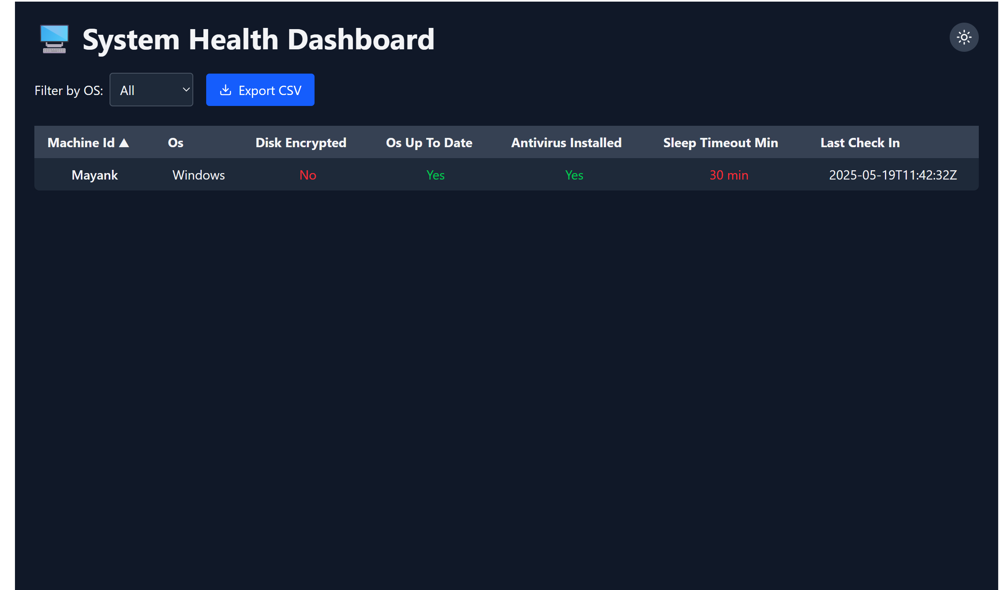

# System Health Monitoring Dashboard

> A full-stack system health monitoring solution featuring a cross-platform Python utility, a Flask backend API, and a React + Tailwind CSS admin dashboard (Vite).


## Table of Contents

- [🚀 Project Overview](#-project-overview)
- [🎯 Features](#-features)
- [📦 Architecture & File Structure](#-architecture--file-structure)
- [⚙️ Prerequisites](#️-prerequisites)
- [🔧 Installation & Setup](#-installation--setup)
- [▶️ Running the Project](#️-running-the-project)
- [🖼️ Screenshots](#️-screenshots)
- [📖 Usage](#-usage)
- [❓ Troubleshooting](#-troubleshooting)
- [🤝 Contributing](#-contributing)
- [📞 Contact & Support](#-contact--support)
- [📄 License](#-license)

---

## 🚀 Project Overview

This project provides:

1. **System Utility (Client)**: A lightweight, cross-platform Python script that runs as a background daemon. It periodically gathers system health metrics (disk encryption, OS updates, antivirus status, sleep timeout) and reports only on changes to a central API.
2. **Backend API (Flask)**: A simple RESTful service that receives reports from the utility and stores the most recent state per machine in memory. It exposes endpoints to retrieve all machine data.
3. **Admin Dashboard (React + Tailwind CSS)**: An interactive web interface (built with Vite) that displays real-time system health data, allows filtering/sorting, supports CSV export, and features a light/dark mode toggle.

<!-- Architecture diagram needs to be updated once proper path is confirmed -->
<!--  -->

---

## 🎯 Features

* **✅ Cross-Platform Utility**: Works on Windows, macOS, and Linux.
* **📊 Efficient Reporting**: Only sends data when metrics change, reducing network usage.
* **⚡ Real-Time Dashboard**: Displays latest metrics for all machines.
* **🌓 Light/Dark Mode**: Toggle between themes for comfortable viewing.
* **🔍 Filtering & Sorting**: Filter by OS and sort on any metric.
* **📁 CSV Export**: Download the current table view as a CSV file.

---

## 📦 Architecture & File Structure

### Data Flow

1. **Collection**: The Python utility collects system metrics from the local machine.
2. **Processing**: The utility compares current metrics with previous values to detect changes.
3. **Transmission**: When changes are detected, the utility sends an HTTP POST to the backend API.
4. **Storage**: The Flask backend stores the latest state of each machine in memory.
5. **Retrieval**: The React frontend periodically polls the API for updated data.
6. **Visualization**: The dashboard renders the data in a sortable, filterable table format.

```
project/
├── utility/             # Python client utility
│   └── client.py        # Main monitoring script
│
├── backend/             # Flask API server
│   ├── server.py        # API implementation
│   └── requirements.txt # Python dependencies
│
└── frontend/            # React + Tailwind dashboard (Vite)
    ├── public/          # Static assets (index.html)
    ├── src/
    │   ├── assets/      # Images & icons
    │   ├── App.jsx      # Main React component
    │   ├── index.css    # Global styles (incl. Tailwind directives)
    │   └── main.jsx     # React entry point
    ├── package.json     # NPM dependencies & scripts
    ├── tailwind.config.js  # Tailwind configuration
    └── vite.config.js   # Vite configuration
```

---

## ⚙️ Prerequisites

* **Python 3.7+** (utility & backend)
* **Node.js 14+** and **npm** (frontend)
* Git (optional, for cloning repository)

### OS Compatibility Matrix

| Component | Windows | macOS | Linux |
|-----------|---------|-------|-------|
| Utility   | ✅      | ✅    | ✅    |
| Backend   | ✅      | ✅    | ✅    |
| Frontend  | ✅      | ✅    | ✅    |

---

## 🔧 Installation & Setup

### 1. Clone the Repository

```bash
git clone https://github.com/mayank-singh-chauhan0/Solsphere.ai_Assignment.git
cd Solsphere.ai_Assignment
```

### 2. Backend (Flask API)

```bash
cd backend
python -m venv venv             # Create virtual environment
# macOS/Linux:
source venv/bin/activate
# Windows (PowerShell/CMD):
# .\venv\Scripts\activate

pip install -r requirements.txt  # Install Flask & CORS
```

### 3. Utility (Python Client)

```bash
cd ../utility
python -m venv venv
# Activate same as above
pip install requests psutil
```

### 4. Frontend (React + Vite)

```bash
cd ../frontend
npm install                      # Install dependencies
```

---

## ▶️ Running the Project

Open **three separate terminals** (or split panes):

1. **Backend API**

   ```bash
   cd backend
   source venv/bin/activate   # activate venv
   python server.py
   ```

   The API will start at: `http://localhost:5000`

2. **Utility (Client)**

   ```bash
   cd utility
   source venv/bin/activate
   python client.py
   ```

   The utility runs continuously, detecting changes and POSTing to the backend.

3. **Frontend Dashboard**

   ```bash
   cd frontend
   npm run dev
   ```

   The dashboard will be available at: `http://localhost:5173`

---

## 🖼️ Screenshots

### Dashboard in Light Mode

*The dashboard showing system health metrics with light theme enabled, displaying system health status of multiple machines with filtering and sorting capabilities.*

### Dashboard in Dark Mode

*The same dashboard with dark theme enabled, providing better visibility in low-light environments while maintaining all functionality.*

---

## 📖 Usage

* **Filter**: Use the OS dropdown to show only Windows, macOS (Darwin), or Linux machines.
* **Sort**: Click any column header to sort ascending/descending.
* **Export**: Click **Export CSV** to download the current table.
* **Theme**: Toggle the sun/moon icon to switch themes.

---

## ❓ Troubleshooting

### Common Issues

1. **Utility not connecting to backend**
   - Verify the backend is running on the expected port
   - Check network connectivity and firewall settings
   - Confirm the API URL in the utility matches the running backend

2. **Dashboard not showing data**
   - Ensure the backend API is running and accessible
   - Check browser console for any CORS or network errors
   - Verify the API base URL in the frontend configuration

3. **OS-specific metric collection errors**
   - Windows: Ensure PowerShell is available for certain system queries
   - macOS: Some metrics may require admin privileges
   - Linux: Different distributions may require different commands

---

## 🤝 Contributing

Contributions are welcome! Please feel free to submit a Pull Request.

## 📞 Contact & Support

- 📧 **Email**: [mayank@example.com](mailto:mayank@example.com)
- 🐙 **GitHub**: [Create an issue](https://github.com/mayank-singh-chauhan0/Solsphere.ai_Assignment/issues)
- 🌐 **Portfolio**: [Mayank Singh Chauhan](https://github.com/mayank-singh-chauhan0)

## 📄 License

This project is open source and available under the [MIT License](LICENSE).

---

<p align="center">Developed with ❤️ by <a href="https://github.com/mayank-singh-chauhan0">Mayank Singh Chauhan</a></p>

